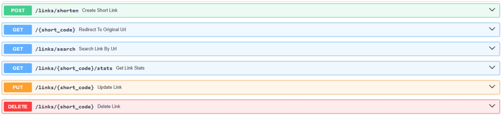

# Applied Python HW3

## Инструкция по запуску
1. Склонировать репозиторий: ```git clone https://github.com/ropolts/applied_python_hw3.git```
2. Перейти в директорию репозитория: ```cd applied_python_hw3```
3. Запустить сервис: ```docker-compose up --build```

## Реализованные функции
1. Создание / удаление / изменение / получение информации по короткой ссылке
2. Статистика по ссылке
3. Создание кастомных ссылок (уникальный alias)
4. Поиск ссылки по оригинальному URL

## Демонстрация работы
[Скринкаст](https://disk.360.yandex.ru/i/xYoEClDxRprSsg)

## API endpoints


## Доступ к сервису и документация
- http://localhost:8000
- http://localhost:8000/docs
